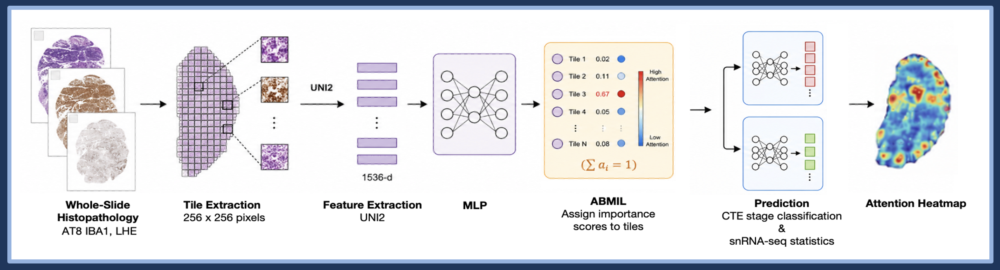
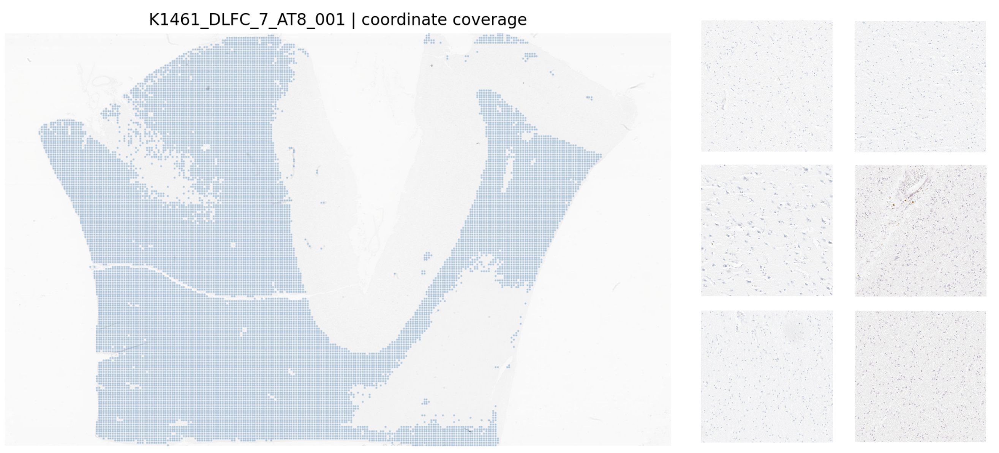
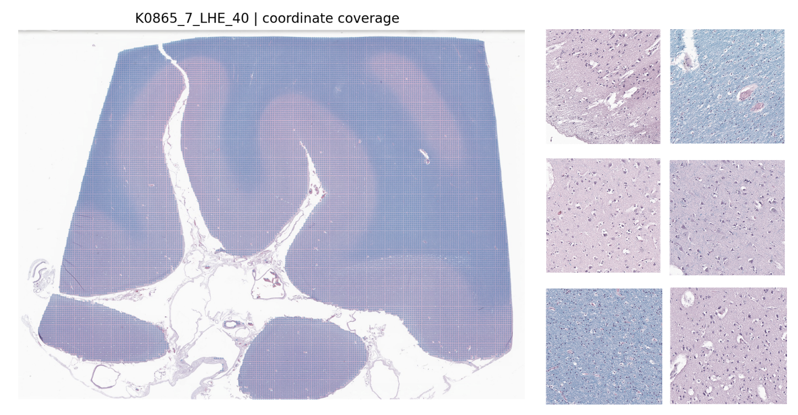
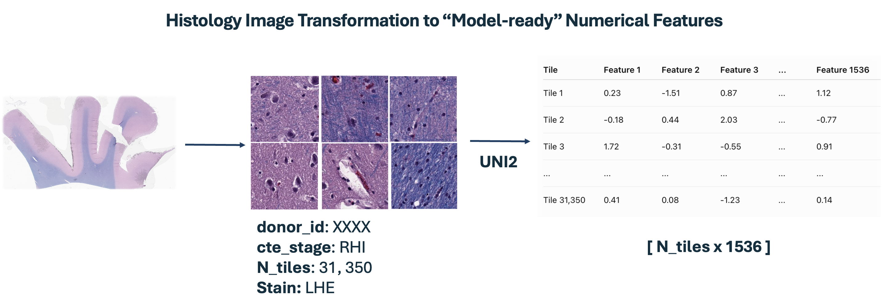
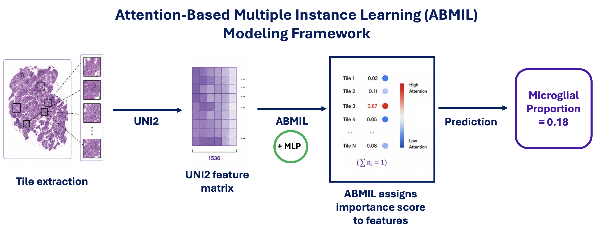

# Image-to-Transcriptome: Predicting Neuroinflammatory Signatures from Brain Histology in Chronic Traumatic Encephelopathy (CTE)


## Project Overview 

**Chronic Traumatic Encephalopathy** (CTE) is a **neurodegenerative disease** associated with repeated head impacts, such as those experienced through contact sports and other forms of repetitive head trauma. The disease is characterized by the abnormal accumulation of phosphorylated tau (p-tau) in the brain, with pathology becoming more widespread as CTE progresses. CTE severity is also linked with extensive neuroinflammatory response involving **microglia**, the brain's immune cells. 

**Histolopathology** imaging presents a spatial view of morphological changes in brain tissue across CTE stages, while **single-nucleus RNA sequencing (snRNA-seq)** provides a molecular view through cell-type-specific expression. This project integrates a donor-level paired dataset of histopathogy whole-slide images (WSI) with snRNA-seq to investigate quantitative relationships in tissue morphology to predict CTE disease stage, and underlying transcriptomic signatures. 


## Primary Objective

Develop an **attention-based deep learning framework** to predict donor-level disease and molecular features from whole-slide brain histopathology and identify histologically the brain regions contributing to model predictions.

---

## Secondary Objectives

1. **Predict CTE disease stage from whole-slide histopathology across various stains (LHE, IBA1, AT8)**

   * Evaluate whether learned histologic features can distinguish CTE disease severity at the donor level.

2. **Predict donor-level transcriptomic variation from histology**

   * Model features derived from snRNA-seq using stain-specific morphology and cell-type-specific gene expression.

3. **Visualize histologic regions driving model predictions through attention heatmaps**

   * Use learned attention scores, spatial heatmaps, and high-attention tissue tiles to visualize regions contributing to disease-stage and transcriptomic predictions.

## Methodology

<p align="center">
  
</p>
<p align="center">
  <em>Overview of the image-to-transcriptome deep learning model framework.</em>
</p>   

#### Methodology Overview  

*CTE donor Whole-slide histopathology images (WSI) stained by **LHE, AT8, and IBA1** undergo tissue segmentation to generate **tissue-containing tiles (256 x 256 pixels)**. The UNI2 foundation model generates a 1536 dimensional feature vector for each tile. Each donor WSI is represented as an [N_tiles x 1536] feature matrix. These features are modeled using **attention-based multiple instance learning (ABMIL)**, that assigns importance scores to each tile (model features), learning their influence in predicting the selected target. The framework supports both **CTE stage classification** and **regression of continuous transcriptomic features** derived from **snRNA-seq analysis** using 5-fold donor-level cross-validation. The recorded attention scores (per tile) are mapped to their original locations on the provided histology image to create a heatmap for each donor visualizing the **high-attention (highly influential)** histologic regions contributing to model predictions.*

## How to Run the Code
---

### Environment Setup

Two Conda environments are provided to support different stages of the workflow:

* `cte-histology` — General-purpose environment for data preparation, whole-slide image processing, quality control, and visualization.
* `cte-histology-gpu` — GPU-enabled environment for deep learning workflows, including UNI2 feature extraction and model training.

Create the standard environment using:

```bash
conda env create -f environment/cte-histology.yml
conda activate cte-histology
```

For GPU-enabled workflows:

```bash
conda env create -f environment/cte-histology-gpu.yml
conda activate cte-histology-gpu
```

The GPU environment uses **PyTorch 2.0.1 with CUDA 11.8**. GPU compatibility may depend on the hardware available on the system.


### 1. Data Processing

#### 1.1 Prepare Whole Slide Image Metadata 

Create a standardized metadata table describing provided whole-slide images. 

`make_slide_metadata_from_directory.py` -- builds slide metadata from files organized with donor-specific naming within a WSI directory

**Usage**: 

```
python -m src.data_processing.make_slide_metadata_from_directory \
    --slides-dir /path/to/slide_image/storage/directory \
    --region DLFC \
    --output-csv /path/to/output/metadata
```        

`make_slide_metadata_from_case_list.py` -- builds slide metadata from a predefined case list (csv or excel spreadsheet)

```
python -m src.data_processing.make_slide_metadata_from_case_list \
    --input-csv /path/to/case_list.csv \
    --slides-dir /path/to/slide_image/directory \
    --region DLFC \
    --output-csv /path/to/output/slide_metadata.csv \
    --missing-csv /path/to/missing_slides.csv 
```
**Output**

Both scripts generate stain-specific WSI metadata used in subsequent pipeline steps including tile coordinate extraction, feature extraction, and modeling.

| donor_id | region | section | stain | magnification | slide_id | slide_file | slide_path |
| -------- | ------ | ------- | ----- | ------------- | -------- | ---------- | ---------- |
| K0038    | DLFC   | 7       | LHE   | 20            | ...      | ...        | ...        |

#### 2.2 Generate Tile Coordinates

Identify tissue-containing regions within each whole-slide image (WSI) and generate the tile coordinates used for downstream feature extraction. Only the **coordinates** of retained tiles are saved at this stage; individual image tiles are **not** saved to disk as PNGs.

`generate_tile_coords.py`

**Default Extraction Settings**

| Parameter               | Default          |
| ----------------------- | ---------------- |
| Tile size               | 256 × 256 pixels |
| Stride                  | 256 pixels       |
| Resolution              | 0.5 MPP          |
| Tissue mask             | Otsu             |
| Minimum tissue coverage | 80%              |

*Valid tile locations are retained based on a minimum tissue-coverage threshold.* 

**Usage**

```bash
python src/data_processing/generate_tile_coords.py \
    --metadata /path/to/slide_metadata.csv \
    --coords-out /path/to/tile_coords \
    --summary-out /path/to/tile_coordinate_summary.csv
```

**Output**

The script generates a coordinate CSV for each WSI, organized by brain region and stain:

```text
tile_coords/
└── <region>/
    └── <stain>/
        └── <slide_id>_<parameters>_coords.csv
```

Each coordinate file contains the locations of tissue-containing tiles retained from the corresponding WSI. A separate summary CSV records the number of retained tiles, extraction parameters, coordinate-file location, and processing status for each slide in provided slide image metadata. 

### 2. Quality Control 

`tissue_segmentation_qc.py`

Visually inspect tile-coordinate coverage before feature extraction to confirm that retained coordinates appropriately represent tissue regions within each whole-slide image. Below is a representation of quality control analysis outputs.

<p align="center">
  
  
</p>

<p align="center">
  <em>Example of <strong>poor or incomplete tissue-coordinate coverage (top)</strong> compared with <strong>strong coverage (bottom)</strong> along with the random sample tile patches generated per processed slide. </em>
</p>
 

 Generates a whole-slide thumbnail, coordinate coverage map, and randomly sampled context patches for selected slides. Slides can be processed by **donor ID**, **slide ID**, or across the full coordinate summary.

**Usage**

To evaluate **all slides** available for a **given donor**:

```bash
python src/quality_control/tissue_segmentation_qc.py \
    --coordinate-summary /path/to/tile_coordinate_summary.csv \
    --slides-dir /path/to/whole_slide_images \
    --output-dir /path/to/qc \
    --donor-ids K0038
```

To evaluate **specific slides**:

```bash
python src/quality_control/tissue_segmentation_qc.py \
    --coordinate-summary /path/to/tile_coordinate_summary.csv \
    --slides-dir /path/to/whole_slide_images \
    --output-dir /path/to/qc \
    --slide-ids K0038_DLFC_7_LHE_20_001
```

Use `--all-slides` to run QC across **every slide in the coordinate summary**.

**Output**

Grouped by donor, for each slide the script generates:

```text
qc/
└── <stain>/
    └── <donor_id>/
        └── <slide_id>/
            ├── 01_thumbnail.png
            ├── 02_coordinate_coverage.png
            ├── context_patches/
            └── context_patch_summary.csv
```
*The coordinate coverage map is used to confirm that tile locations follow the expected tissue regions, while the sampled context patches provide a closer view of the tissue represented by selected coordinates.*

### 3. Feature Extraction

`extract_uni2_embeddings.py`

Converts each retained tissue tile into a numerical feature representation using the **UNI2-h Pathology Foundation Model** for downstream deep learning models.

<p align="center">
  
</p>

<p align="center">
  <em>
    Each retained tissue tile is encoded by UNI2-h as a <strong>1536-dimensional feature vector</strong>, producing an <strong>[N_tiles × 1536]</strong> feature matrix for each WSI.
  </em>
</p>

UNI2 feature extraction is GPU-accelerated, **activate the GPU environment before running this step**:

```bash
conda activate cte-histology-gpu
```

**Usage**

```bash
python src/data_processing/extract_uni2_embeddings.py \
    --metadata /path/to/tile_coordinate_summary.csv \
    --embedding-root /path/to/embeddings/output/directory\
    --index-out /path/to/output/embedding_index.csv
```

*Use `--smoke-test` to process only the first slide in the coordinate summary for verifying the feature extraction workflow before running the full dataset.*

**Output**

For each WSI, the script saves a PyTorch .pt file containing the UNI2 tile embeddings to the output directory. An **embedding index CSV** is also generated to track all processed slides within the input csv and their embedding files.

```text
embeddings/
└── <region>/
    └── <stain>/
    ├── slide_id_1.pt
    ├── slide_id_2.pt
    ├── ...
    └── <stain>_embedding_index.csv
```

### 4. Modeling

The extracted **[N_tiles × 1536] UNI2 feature matrices** are modeled using
**attention-based multiple instance learning (ABMIL)** to generate donor-level predictions.

Each WSI is treated as a collection, or *bag*, of tile-level feature vectors.
The model learns an attention score for each tile and combines the weighted tile
features into a single donor-level representation used for prediction.

<p align="center">
  
</p>

<p align="center">
  <em>
    Overview of the shared ABMIL framework used for donor-level CTE stage
    classification and transcriptomic regression.
  </em>
</p>

#### 4.1 Shared ABMIL Framework

`cte_abmil.py`

Defines the shared **ABMIL model architecture and dataset classes** used by both
prediction workflows. The classification and regression scripts import these
components and provide task-specific (classification/regression) training, prediction, and evaluation logic.

| Prediction Task | Modeling Script | Target |
| --- | --- | --- |
| CTE Stage Classification | `abmil_cte_stage_classification.py` | CTE disease stage |
| snRNA-seq Regression | `abmil_snRNAseq_regression.py` | Continuous transcriptomic features |


#### 4.2 CTE Stage Classification

`abmil_cte_stage_classification.py`

Train an **ABMIL classifier** to predict **CTE disease stage using UNI2
embeddings**. Model evaluation is performed using **donor-level cross-validation**.

**Usage**

```bash
python src/modeling/abmil_cte_stage_classification.py \
    --metadata /path/to/classification_metadata.csv \
    --output-dir /path/to/results \
    -- stain <stain>
    --coordinate-source
    --target-name low_vs_high
```

**Output**

Each modeling run creates a structured results directory containing donor-level attention heatmaps & highest attention tiles, model
predictions and summaries, cross-validation metrics, and tile-level attention scores per image.

```
results/
└── <run_name>/
    ├── attention_scores/
    ├── attention_heatmaps/
    ├── top_attention_tiles/
    ├── confusion_matrix.png
    ├── roc_curve.png
    ├── predictions.csv
    ├── fold_metrics
    ├── ... (additional run statistics)
    └── run_config.json

```    

#### 4.3 snRNA-seq Molecular Feature Prediction (Continuous Targets)

`abmil_snRNAseq_regression.py`

Train an ABMIL regression model to predict **continuous donor-level molecular
features derived from snRNA-seq** using histology image UNI2 embeddings.

**Usage**

```bash
python src/modeling/abmil_snRNAseq_regression.py \
    --metadata /path/to/regression_metadata.csv \
    --stains <stain> 
    --output-dir /path/to/results \
    --target-name microglia \
    --targets pc1_mean pc2_mean \
    --run-name iba1_microglia_pc1_pc2
```
*Use other available optional run tags including `--filter-name` or `coordinate_source` for more specific directory naming.* 

**Output**

Each modeling run creates a structured results directory containing **donor-level attention heatmaps & highest attention tiles, observed vs. predicted plots**, model summaries and fold metrics, cross-validation metrics, and tile-level attention scores per image.

```text
results/
    └── <run_name>/
        ├── checkpoints/
        ├── attention_scores/
        ├── attention_heatmaps/
        ├── top_attention_tiles/
        ├── plots/
        │   ├── <target_1>_observed_vs_predicted.png
        │   └── <target_2>_observed_vs_predicted.png
        │
        ├── fold_*_training_history.csv
        ├── fold_metrics.csv
        ├── oof_predictions.csv
        ├── pooled_oof_metrics.json
        └── run_config.json
``` 

### Modeling Results & Visualizations


